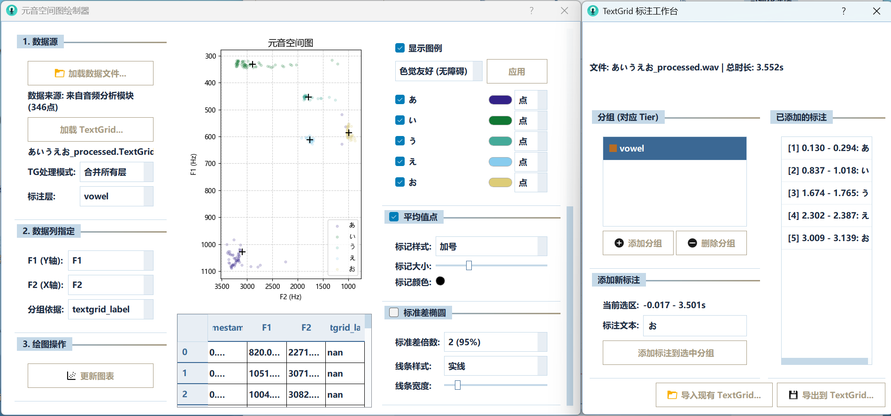
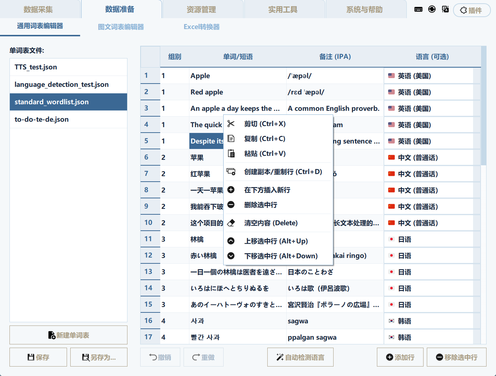
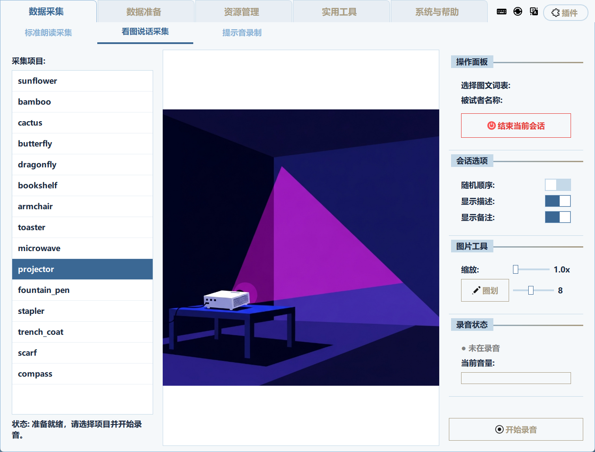
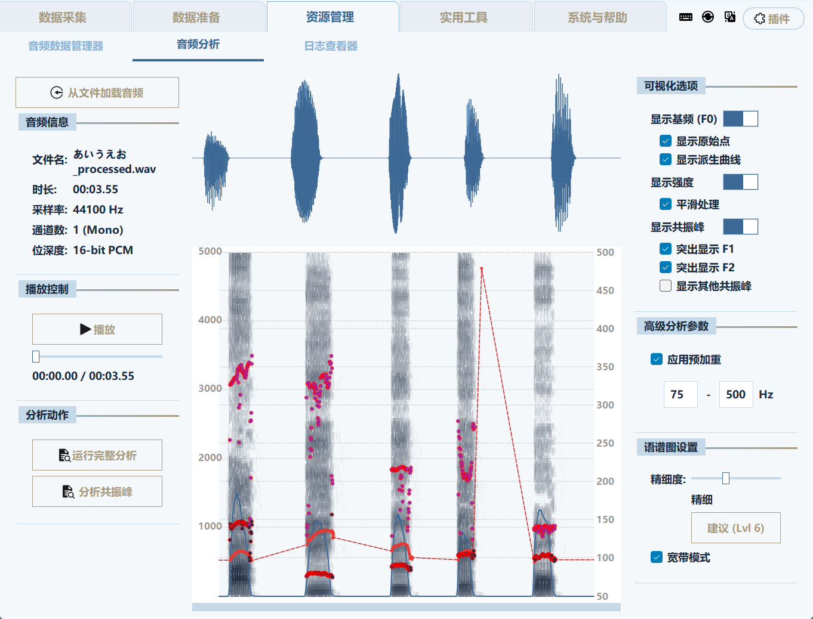
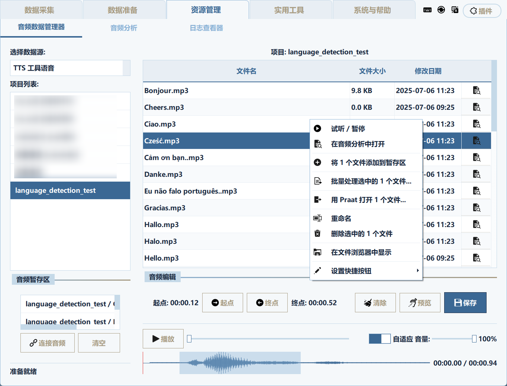
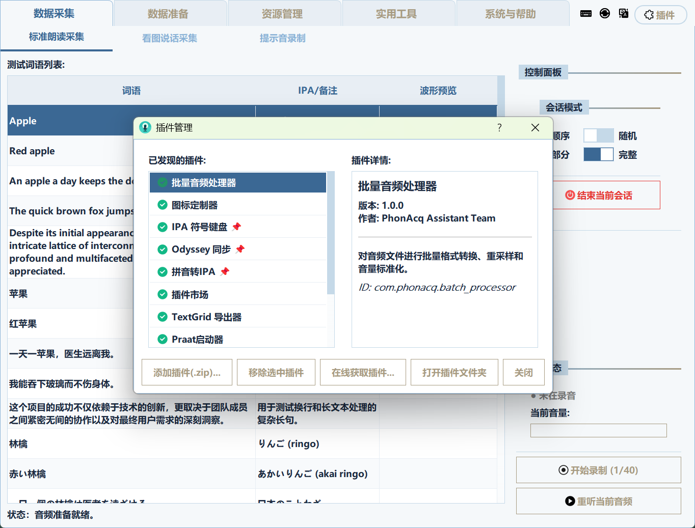

# PhonAcq Assistant (风纳客)

<p align="center">
  
</p>

<p align="center">
  <strong>一款为语言学研究者设计的集成化桌面应用程序，旨在简化和规范语音数据的采集与管理流程。</strong>
</p>

<p align-center">
    <a href="#-功能特性">功能特性</a> •
    <a href="#-安装与运行">安装与运行</a> •
    <a href="#-模块详解">模块详解</a> •
    <a href="#-开发与贡献">开发与贡献</a> •
    <a href="#-常见问题">常见问题</a>
</p>

---
## 注意
**本项目大部分代码以及 README 由 Gemini Pro 贡献。**

插件项目地址：https://github.com/KasumiKitsune/PhonAcq-Official-Plugins

## 界面截图
<div align="center">
  <div style="display: inline-block; width: 48%; vertical-align: top; margin: 10px;">
    
    <p><strong>TextGrid标注及元音分析界面</strong><br><em>展示了与TextGrid文件集成的元音空间图绘制器，以及标注数据的可视化。</em></p>
  </div>
  <div style="display: inline-block; width: 48%; vertical-align: top; margin: 10px;">
    
    <p><strong>词表编辑界面</strong><br><em>用户可以在这里创建、修改和管理项目的词表数据。</em></p>
  </div>
</div>
<div align="center">
  <div style="display: inline-block; width: 48%; vertical-align: top; margin: 10px;">
    
    <p><strong>图文采集界面</strong><br><em>支持结合图片进行语音采集，适用于方言研究等场景。</em></p>
  </div>
  <div style="display: inline-block; width: 48%; vertical-align: top; margin: 10px;">
    
    <p><strong>音频分析界面</strong><br><em>提供波形图、语谱图和声学参数的可视化分析功能。</em></p>
  </div>
</div>
<div align="center">
  <div style="display: inline-block; width: 48%; vertical-align: top; margin: 10px;">
    
    <p><strong>音频管理界面</strong><br><em>集中管理项目中的所有音频数据，支持批量操作。</em></p>
  </div>
  <div style="display: inline-block; width: 48%; vertical-align: top; margin: 10px;">
    
    <p><strong>主界面及插件管理</strong><br><em>展示了应用程序的核心布局以及插件管理对话框。</em></p>
  </div>
</div>

## 📖 项目简介

**PhonAcq Assistant (风纳客)** 旨在解决语言学（特别是音韵学、方言学和第二语言习得领域）研究中常见的数据采集痛点。传统的实验流程往往涉及多个独立的软件、繁琐的文件管理和易错的手动操作。本项目将**语料构建、数据采集、数据管理和实用工具**整合到一个统一、直观、高效的图形化平台中，让研究者能更专注于实验设计与数据分析本身。

所有用户数据（如录音、词表、配置等）均保存在您本地计算机的程序文件夹内，确保了数据的私密性与安全性。

## ✨ 功能特性

*   **多范式数据采集**:
    *   **标准朗读采集**: 支持标准的“文本-语音”跟读实验，适用于最小音对、句子复述等场景。
    *   **图文采集**: 支持“图片-语音”的采集范式，适用于图片命名、方言调查等。
    *   **提示音录制**: 允许为标准词表录制高质量的真人语音提示库。

*   **结构化的语料管理**:
    *   **JSON 优先**: 使用行业标准的 `.json` 格式作为词表文件，结构清晰，易于编辑和分享。
    *   **集成化编辑器**: 为标准词表和图文词表提供独立的内置编辑器，支持丰富的编辑操作（如右键菜单、拖拽图片管理等）。
    *   **格式转换**: 内置Excel/CSV与JSON的双向转换工具，方便与使用不同软件的合作者交换数据。

*   **集成的音频工作流**:
    *   **音频管理器**: 集中浏览、试听、管理所有采集到的音频数据。
    *   **轻量级编辑**: 在管理器中直接对音频进行波形级的**精准裁切**和多文件**拼接**。
    *   **声学分析**: 内置音频分析工具，可查看波形、语谱图，并提取/显示**基频(F0)**、**强度(Intensity)**和**共振峰(Formants)**。

*   **辅助工具集**:
    *   **TTS 工具**: 批量将文本词条转换为语音文件，并能无缝集成到“速记卡”模块。
    *   **速记卡**: 基于**主动回忆**和**间隔重复**算法，将任何词表转化为智能学习工具。
    *   **日志查看器**: 以结构化视图审查实验过程日志，或分析速记卡学习进度。

*   **高度可扩展**:
    *   **插件系统**: 提供了一套完整的插件API，允许开发者创建新功能、与外部软件（如Praat）集成，或自定义程序行为。
    *   **主题系统**: 支持通过QSS样式表完全自定义程序外观，包括颜色、字体和图标。

## 📥 安装与运行

### 1. 对于普通用户 (使用打包好的可执行文件)

1.  前往本项目的 [**Releases**](https://github.com/KasumiKitsune/PhonAcq-Assistant/releases) 页面。
2.  下载最新版本的压缩包（例如 `PhonAcq-Assistant-vX.X-Windows.zip`）。
3.  解压到一个您喜欢的位置。
4.  双击文件夹内的 `Canary.exe` 可执行文件即可运行。

### 2. 对于开发者 (从源码运行)

1.  **环境要求**: Git, Python (推荐 3.10+)。

2.  **克隆与设置**:
    ```bash
    # 1. 克隆仓库
    git clone https://github.com/KasumiKitsune/PhonAcq-Assistant.git
    cd PhonAcq-Assistant

    # 2. 创建并激活虚拟环境 (推荐)
    python -m venv venv
    # Windows
    .\venv\Scripts\activate
    # macOS/Linux
    source venv/bin/activate

    # 3. 安装依赖
    pip install -r requirements.txt
    ```

3.  **运行程序**:
    ```bash
    python Canary.py
    ```

## 🧩 模块详解

本软件的功能通过模块化的标签页进行组织：

*   `数据采集`:
    *   **标准朗读采集**: 进行“听-说”范式实验。
    *   **看图说话采集**: 进行“看-说”范式实验，通过图片引导自然话语。
    *   **提示音录制**: 为标准词表录制真人提示音，以替代TTS。

*   `数据准备`:
    *   **通用词表编辑器 Plus**: 创建和编辑用于标准采集的 `.json` 词表，支持元数据编辑和丰富的右键操作。
    *   **图文词表编辑器**: 创建和编辑包含图片、提示和备注的图文 `.json` 词表。
    *   **Excel 转换器**: 在 JSON, Excel, CSV 等格式间自由转换词表。

*   `资源管理`:
    *   **音频数据管理器**: 浏览、试听、管理所有采集到的音频数据，并支持裁切、拼接等编辑操作。
    *   **音频分析**: 对单个音频进行详细的声学分析。
    *   **日志查看器**: 审查实验过程日志或分析速记卡学习进度。

*   `实用工具`:
    *   **TTS 工具**: 批量将文本词条转换为语音文件。
    *   **速记卡**: 基于间隔重复算法的智能化学习和复习工具。

*   `系统与帮助`:
    *   **程序设置**: 配置程序的主题、路径、音频参数等。
    *   **插件管理**: 安装、卸载、启用或禁用外部功能插件。
    *   **帮助文档**: 详细的内置使用指南。

## 🔧 开发与贡献

### 设计哲学
- **模块化**: 核心功能被划分为独立的内部模块 (`modules/`)。
- **可扩展性**: 强烈推荐通过插件系统 (`plugins/`) 来添加新功能。插件与主程序松散耦合，可由用户自由管理。
- **数据开放**: 所有用户数据都以标准、人类可读的格式（JSON, WAV, CSV）存储在本地。

### 插件系统
插件是扩展PhonAcq Assistant的首选方式。一个插件本质上是一个包含`plugin.json`描述文件和Python代码的文件夹。通过实现`BasePlugin`接口，插件可以：
- 创建独立的UI窗口。
- 通过“钩子”模式与核心模块的UI（如右键菜单）进行交互。
- 修改或增强核心服务。

我们鼓励开发者优先为新功能创建插件。

### 参与贡献
我们欢迎任何形式的贡献！无论是提交 bug 报告、建议新功能，还是直接贡献代码。

1.  **Fork** 本仓库。
2.  创建一个新的分支 (`git checkout -b feature/YourAmazingFeature`)。
3.  进行您的修改。
4.  提交您的更改 (`git commit -m 'Add some AmazingFeature'`)。
5.  将您的分支推送到远程仓库 (`git push origin feature/YourAmazingFeature`)。
6.  创建一个 **Pull Request**。

## ❓ 常见问题

**Q1: 双击程序后没反应或一闪而过？**
*   **A:** 您的安全软件（如Windows Defender）可能误拦截了程序。请检查其“保护历史记录”，将程序标记为“允许”，并将整个程序文件夹添加到“排除项”中。

**Q2: 点击“开始新会话”后，长时间卡在“正在生成TTS”？**
*   **A:** TTS功能需要连接Google服务器。请检查您的网络连接。最佳实践是使用“提示音录制”模块预先录制真人语音包，这样程序将不再需要网络。

**Q3: 录制的声音太小或太大（有破音）？**
*   **A:** 请先调整您**操作系统**的麦克风输入音量。然后再到本程序的 `程序设置 -> 音频与录音` 中，微调“录音音量增益”滑块。

**Q4: 如何备份或迁移我的所有数据？**
*   **A:** PhonAcq Assistant 是“绿色”便携软件。只需**完整地复制整个程序文件夹**到您的备份位置或新电脑上即可。所有的设置、词表、录音和学习进度都会被完整保留。

## 📜 许可证 (License)

本项目采用 [MIT 许可证](LICENSE.txt)。